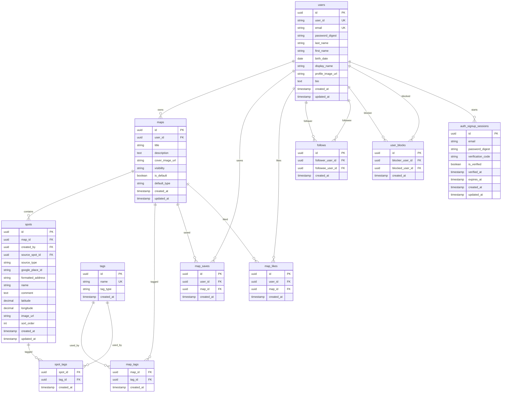

# inow DB / ER 図

- 対象: MVP
- 参照元: `docs/inow_specification.md`, `docs/inow_api_specification.md`
- 目的: MVP に必要な主要テーブル、関係、制約を整理する

## 1. 設計方針

- マップが主役であり、スポットは必ずいずれか 1 つのマップに属する
- 公開範囲はマップ単位で保持する
- スポット保存は参照ではなく複製として扱う
- `お気に入り` `行きたい` はユーザー作成完了時に自動生成されるデフォルトマップとする

## 2. テーブル一覧

| テーブル名 | 用途 |
| --- | --- |
| `users` | ユーザー基本情報 |
| `auth_signup_sessions` | 新規登録途中の認証状態 |
| `maps` | マップ本体 |
| `spots` | マップ内スポット |
| `tags` | タグマスタ |
| `map_tags` | マップとタグの中間 |
| `spot_tags` | スポットとタグの中間 |
| `map_saves` | 他人のマップ保存 |
| `map_likes` | マップいいね |
| `follows` | フォロー関係 |
| `user_blocks` | ブロック関係 |

## 3. ER 図

## 4. 主要テーブル定義

### 4-1. users
| カラム | 型 | 制約 | 備考 |
| --- | --- | --- | --- |
| `id` | UUID | PK | |
| `user_id` | varchar(50) | NOT NULL, UNIQUE | 公開 ID |
| `email` | varchar(255) | NOT NULL, UNIQUE | ログイン用 |
| `password_digest` | varchar(255) | NOT NULL | ハッシュ値 |
| `last_name` | varchar(50) | NOT NULL | |
| `first_name` | varchar(50) | NOT NULL | |
| `birth_date` | date | NOT NULL | |
| `display_name` | varchar(30) | NOT NULL | |
| `profile_image_url` | text | NULL | |
| `bio` | text | NULL | |
| `created_at` | timestamp | NOT NULL | |
| `updated_at` | timestamp | NOT NULL | |

### 4-2. auth_signup_sessions
| カラム | 型 | 制約 | 備考 |
| --- | --- | --- | --- |
| `id` | UUID | PK | |
| `email` | varchar(255) | NOT NULL | 仮登録メール |
| `password_digest` | varchar(255) | NOT NULL | 仮登録パスワード |
| `verification_code` | varchar(20) | NOT NULL | |
| `is_verified` | boolean | NOT NULL | |
| `verified_at` | timestamp | NULL | |
| `expires_at` | timestamp | NOT NULL | |
| `created_at` | timestamp | NOT NULL | |
| `updated_at` | timestamp | NOT NULL | |

### 4-3. maps
| カラム | 型 | 制約 | 備考 |
| --- | --- | --- | --- |
| `id` | UUID | PK | |
| `user_id` | UUID | NOT NULL, FK | `users.id` |
| `title` | varchar(100) | NOT NULL | |
| `description` | text | NULL | |
| `cover_image_url` | text | NULL | |
| `visibility` | varchar(20) | NOT NULL | `public`, `private` |
| `is_default` | boolean | NOT NULL | デフォルトマップ判定 |
| `default_type` | varchar(30) | NULL | `favorite`, `want_to_go` |
| `created_at` | timestamp | NOT NULL | |
| `updated_at` | timestamp | NOT NULL | |

#### 制約
- `default_type` は `is_default = true` の時のみ設定可能
- 1 ユーザーにつき `favorite` と `want_to_go` は各 1 件まで
- デフォルトマップは `visibility = private` 固定
- デフォルトマップは `description`, `cover_image_url` を持たない前提

### 4-4. spots
| カラム | 型 | 制約 | 備考 |
| --- | --- | --- | --- |
| `id` | UUID | PK | |
| `map_id` | UUID | NOT NULL, FK | `maps.id` |
| `created_by` | UUID | NOT NULL, FK | `users.id` |
| `source_spot_id` | UUID | NULL, FK | 元スポット。複製元記録用 |
| `source_type` | varchar(20) | NOT NULL | `google_place`, `manual`, `copied_spot` |
| `google_place_id` | varchar(255) | NULL | Google Place 由来の場合に保持 |
| `formatted_address` | text | NULL | 表示用住所 |
| `name` | varchar(100) | NOT NULL | |
| `comment` | text | NULL | |
| `latitude` | decimal(10,7) | NOT NULL | |
| `longitude` | decimal(10,7) | NOT NULL | |
| `image_url` | text | NULL | |
| `sort_order` | integer | NOT NULL | 同一 map 内で一意 |
| `created_at` | timestamp | NOT NULL | |
| `updated_at` | timestamp | NOT NULL | |

#### 制約
- 同一マップ内で `sort_order` は重複不可
- `source_spot_id` はスポット保存時のみ設定される
- `source_type = google_place` の場合は `google_place_id` 設定を推奨

### 4-5. tags
| カラム | 型 | 制約 | 備考 |
| --- | --- | --- | --- |
| `id` | UUID | PK | |
| `name` | varchar(50) | NOT NULL, UNIQUE | |
| `tag_type` | varchar(20) | NULL | `free`, `system` など |
| `created_at` | timestamp | NOT NULL | |

### 4-6. map_tags
| カラム | 型 | 制約 | 備考 |
| --- | --- | --- | --- |
| `map_id` | UUID | NOT NULL, FK | `maps.id` |
| `tag_id` | UUID | NOT NULL, FK | `tags.id` |
| `created_at` | timestamp | NOT NULL | |

#### 制約
- PK は `(map_id, tag_id)`

### 4-7. spot_tags
| カラム | 型 | 制約 | 備考 |
| --- | --- | --- | --- |
| `spot_id` | UUID | NOT NULL, FK | `spots.id` |
| `tag_id` | UUID | NOT NULL, FK | `tags.id` |
| `created_at` | timestamp | NOT NULL | |

#### 制約
- PK は `(spot_id, tag_id)`

### 4-8. map_saves
| カラム | 型 | 制約 | 備考 |
| --- | --- | --- | --- |
| `id` | UUID | PK | |
| `user_id` | UUID | NOT NULL, FK | `users.id` |
| `map_id` | UUID | NOT NULL, FK | `maps.id` |
| `created_at` | timestamp | NOT NULL | |

#### 制約
- UNIQUE `(user_id, map_id)`
- 自分のマップ保存は禁止するためアプリケーション制御

### 4-9. map_likes
| カラム | 型 | 制約 | 備考 |
| --- | --- | --- | --- |
| `id` | UUID | PK | |
| `user_id` | UUID | NOT NULL, FK | `users.id` |
| `map_id` | UUID | NOT NULL, FK | `maps.id` |
| `created_at` | timestamp | NOT NULL | |

#### 制約
- UNIQUE `(user_id, map_id)`

### 4-10. follows
| カラム | 型 | 制約 | 備考 |
| --- | --- | --- | --- |
| `id` | UUID | PK | |
| `follower_user_id` | UUID | NOT NULL, FK | `users.id` |
| `followee_user_id` | UUID | NOT NULL, FK | `users.id` |
| `created_at` | timestamp | NOT NULL | |

#### 制約
- UNIQUE `(follower_user_id, followee_user_id)`
- 自己フォロー禁止

### 4-11. user_blocks
| カラム | 型 | 制約 | 備考 |
| --- | --- | --- | --- |
| `id` | UUID | PK | |
| `blocker_user_id` | UUID | NOT NULL, FK | `users.id` |
| `blocked_user_id` | UUID | NOT NULL, FK | `users.id` |
| `created_at` | timestamp | NOT NULL | |

#### 制約
- UNIQUE `(blocker_user_id, blocked_user_id)`

## 5. インデックス方針

- `users.user_id`
- `users.email`
- `maps.user_id`
- `maps.visibility`
- `maps.default_type`
- `spots.map_id`
- `spots.google_place_id`
- `spots.latitude, spots.longitude`
- `map_saves.user_id`
- `map_likes.map_id`
- `follows.follower_user_id`
- `follows.followee_user_id`

## 6. 業務ルール

### 6-1. デフォルトマップ
- ユーザー作成完了時に `お気に入り` `行きたい` を自動作成する
- デフォルトマップは削除不可
- デフォルトマップはタイトル変更不可
- デフォルトマップは説明文、カバー画像を持たない
- デフォルトマップは常に非公開

### 6-2. 公開範囲
- `maps.visibility = public` の場合のみ第三者に閲覧許可
- `spots` は所属 `maps.visibility` に従う

### 6-3. スポット保存
- 他人のスポットを保存する時は `spots` に新規行を追加する
- 元スポットを追跡したい場合のみ `source_spot_id` を利用する

## 7. 今後の拡張候補

- `notifications`
- `recommended_maps`
- `map_view_histories`
- `spot_images` の別テーブル化
